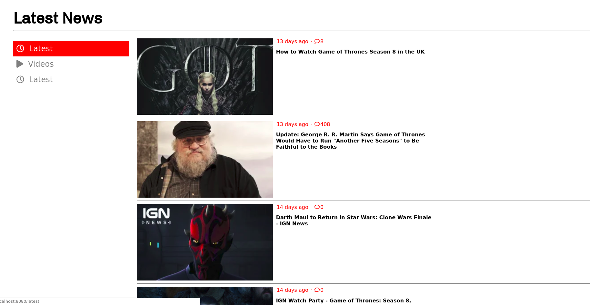

# API call practice
Goal of the project was the GET resources from a REST endpoint. 
To test locally, pull the repo then npm install/start.
Navigate to localhost:8080/news

The goal page looked like this: 

My version ended up looking like this: 

